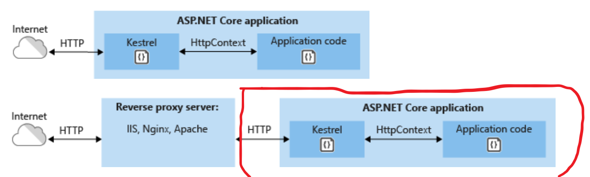

# Cours .net

## Prérequis

Avoir installé .net core 8.0

```bash
dotnet --version //verifie la version de .net

donet --list-sdks //liste les sdk installés

```

Pour les schémas, allez sur https://app.diagrams.net/

## Objectifs fin de semaine

Faire une API REST avec .net  8.0

## Cours

### Definitions

.net est un framework de développement logiciel libre écrit en C# et créé par Microsoft. Il fonctionne sous Windows, Windows CE, Windows Mobile, Linux, Mac OS X, Solaris et FreeBSD. Il est basé sur le Common Language Runtime (CLR) et son langage de programmation principal est C#.

### À savoir:

.net core n'existe plus depuis la version 3.1

### Voici un apercu de la technologie .net:


### Comment sont appelés les dependances dans .net?

Les dépendances sont des packages se nommant NuGet.

### Qu'est ce que le patterne MVC?
#### Model View Controller
Le pattern MVC est un pattern de conception qui permet de séparer les préoccupations d'une application en trois couches distinctes. Le modèle (Model) contient les données et la logique métier. La vue (View) contient la présentation de l'interface graphique. Le contrôleur (Controller) contient la logique concernant la façon dont les données sont présentées à l'utilisateur.

Logique métier: C'est la logique qui permet de faire fonctionner l'application. Par exemple, si on prend une application de gestion de stock, la logique métier sera la gestion des stocks, des commandes, des clients, etc.

Logique de présentation: C'est la logique qui permet de présenter les données à l'utilisateur. Par exemple, si on prend une application de gestion de stock, la logique de présentation sera la présentation des données des stocks, des commandes, des clients, etc.


### Qu'est ce que le pattern MVVM? (facultatif)
#### Model-View-ViewModel
Le pattern MVVM est un pattern de conception qui permet de séparer les préoccupations d'une application en trois couches distinctes. Le modèle (Model) contient les données et la logique métier. La vue (View) contient la présentation de l'interface graphique. Le ViewModel (ViewModel) contient la logique concernant la façon dont les données sont présentées à l'utilisateur.

## Le cli de .net
Le cli de .net permet de créer des projets, de les compiler, de les lancer, de les tester, de les publier, etc.

## le fichier sln
Le fichier sln est un fichier qui permet de regrouper plusieurs projets.

## Le fichier csproj
Le fichier csproj est un fichier qui permet de décrire un projet.


## Serveur web
Le serveur web fourni ASP .NET Core est Kestrel. Il est léger et rapide. Il est possible de le configurer pour qu'il écoute sur un port spécifique, qu'il utilise HTTPS, etc.



## Les composants de .NET Core 
1. Les Librairie CoreFX

Ces librairie intègre les fonctionnalités de base de .NET Core. Elles sont utilisées par les autres composants de .NET Core. Elles sont disponibles sous l'espace de nom `System.*`.`

